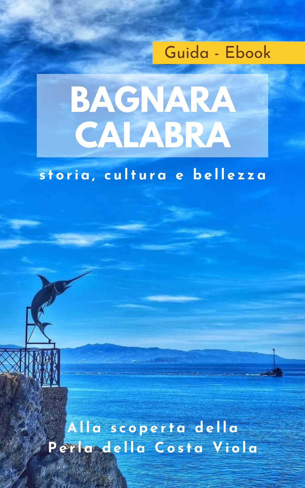

# Guida Turistica: Bagnara Calabra

## Introduzione

Questo progetto ha avuto come obiettivo principale la creazione di una guida turistica accessibile per la città di **Bagnara Calabra**, una destinazione ricca di storia, cultura e bellezze naturali. La guida mira a presentare le principali attrazioni della città in un formato chiaro, visivamente attraente e facilmente consultabile su dispositivi mobili e desktop.  

### Obiettivi
- Offrire una panoramica esaustiva delle principali attrazioni turistiche di Bagnara Calabra.
- Creare una piattaforma user-friendly, con una navigazione intuitiva e una struttura dei contenuti ottimizzata.
- Promuovere la città con l'obiettivo di attrarre turisti e valorizzare il patrimonio locale.

### Tecnologie
Il progetto è stato sviluppato utilizzando una combinazione di tecnologie web moderne, tra cui:
- **HTML5** per la struttura del ebook.
- **CSS** per lo stile.

### Flusso di gestione documentale
La creazione del documento è avvenuta tramite un flusso agile e strutturato, che ha previsto:
- La stesura e la revisione del contenuto testuale.
- L'integrazione e l'ottimizzazione delle immagini per garantire caricamenti rapidi.
- La gestione del SEO (Search Engine Optimization) attraverso metadati e tag, per migliorare la visibilità del sito sui motori di ricerca.

### Risultati
Il risultato finale è una guida turistica che:
- Fornisce informazioni dettagliate su monumenti e attrazioni, accompagnate da immagini rappresentative.
- Integra una mappa (tramite QR Code) con i punti di interesse.[^1]
- Offre una sezione conclusiva che invita il visitatore a scoprire Bagnara Calabra.

[^1]: https://padlet.com/dashboard?mobile_page=Collection&filter=all

## Ideazione 

### Tema

Il tema centrale della guida turistica è la promozione e valorizzazione del patrimonio naturale, culturale e storico della città di **Bagnara Calabra**. Questo prodotto editoriale si propone di far conoscere al visitatore le bellezze locali attraverso una narrazione coinvolgente e visualmente accattivante.

#### Argomenti Correlati
I principali argomenti trattati all'interno della guida turistica includono:
- **Patrimonio storico e culturale**: La guida mette in evidenza i monumenti, le chiese, e i luoghi di interesse storico, come la Chiesa del Carmine e il Castello Ducale, fornendo dettagli storici e artistici.
- **Bellezze naturali**: Ampio spazio è dedicato al paesaggio naturale, alle spiagge e alle acque cristalline che rendono famosa Bagnara, con un focus sulla **Costa Viola**.
- **Enogastronomia locale**: Viene dato risalto alle tradizioni culinarie di Bagnara, con sezioni dedicate ai piatti tipici e ai prodotti locali, come il celebre torrone artigianale e i prodotti ittici.
- **Tradizioni e folklore**: Le tradizioni folkloristiche, come le feste patronali e le rassegne musicali, sono trattati per mostrare l'anima viva e festosa della città.
  
#### Tendenza dell'attenzione sui temi
Il progetto si concentra su una strategia di comunicazione che mira a mettere in risalto:
- **Il turismo esperienziale**: L'attenzione si sposta verso un turismo che coinvolge non solo la visita dei luoghi, ma l'immersione nelle tradizioni, nei sapori e nella cultura locale.
- **La valorizzazione del territorio**: Viene posta particolare enfasi sulla tutela e promozione del paesaggio naturale e del patrimonio storico come elementi centrali per attrarre un pubblico sensibile al turismo sostenibile.
- **La connessione tra passato e presente**: Viene creata una narrazione che lega le radici storiche e culturali della città con le esperienze moderne, offrendo un percorso che guida il visitatore dalla storia ai piaceri contemporanei della città.

Questi temi vengono trattati in modo da creare una guida completa, che non solo accompagna il visitatore nella scoperta del territorio, ma lo invita anche a vivere l'esperienza della città in tutte le sue sfaccettature.

### Destinatari
L'ebook si rivolge a un pubblico diversificato, con un focus su viaggiatori interessati a esperienze autentiche, cultura locale e bellezze naturali[^2]. Di seguito vengono descritte le principali personas alle quali si rivolge la guida, con alcuni scenari d'uso che evidenziano le modalità di fruizione del prodotto.
[^2]: https://it.semrush.com/persona/

[Personas1](https://it.semrush.com/persona/share/6BZTF603XP6bHW_TFVw5pRW00i_iihCIZXQjTFPLweo/)
[Personas2](https://it.semrush.com/persona/share/B77f8PzQOqDTm8I6x6jtBgywikfGMtpr3aM3lo1m--E/)
[Personas3](https://it.semrush.com/persona/share/zMU6TFfZBcXXMOdSdbEChguap8Dq2JZohg-yJnwNtSY/)

### Requisiti di accettazione

Per garantire che la guida turistica di **Bagnara Calabra** soddisfi le aspettative dei destinatari, sono stati definiti una serie di requisiti di accettazione basati su modelli di fruizione efficaci, standard di qualità e innovazioni nel processo di fruizione e nella presentazione dei contenuti.

#### Modelli di fruizione
I modelli di fruizione più efficaci per i nostri destinatari sono:
- **Mobile-friendly**: La guida deve essere facilmente consultabile da dispositivi mobili (smartphone e tablet), poiché la maggior parte dei viaggiatori la userà durante il viaggio.
- **Navigazione intuitiva**: La guida deve avere una struttura semplice, con una mappa interattiva e collegamenti rapidi alle sezioni principali. I destinatari devono poter accedere facilmente alle informazioni desiderate con pochi clic.
- **Accessibilità**: Il testo deve essere chiaro, con un buon contrasto e la possibilità di ridimensionare i contenuti.

#### Aspetti di innovazione

1. **Esperienza interattiva**: L'integrazione di mappe interattive che permettano agli utenti di visualizzare i punti di interesse, calcolare percorsi e visualizzare immagini. Questo rende l’esperienza di fruizione più coinvolgente, fornendo una visione immersiva dei luoghi.
  

#### Qualità dei contenuti
- **Qualità dei contenuti**: Saranno impiegati esperti locali per arricchire la guida con storie, aneddoti e curiosità che solo i residenti possono conoscere. Questa prospettiva locale rende il prodotto più autentico e differenziato rispetto ad altre guide standard.

In sintesi, i requisiti di accettazione si concentrano sulla creazione di una guida turistica interattiva e accessibile, che sappia coinvolgere il pubblico con contenuti di alta qualità e un'esperienza utente innovativa e fluida.

### Canali di distribuzione
Per garantire una diffusione capillare della guida turistica di **Bagnara Calabra**, si intende utilizzare una varietà di canali di distribuzione, come i social(Facebook e Instagram) o magari una pagina web, con l'obiettivo di raggiungere un pubblico ampio e diversificato. Ogni canale richiede specifici formati di output per adattarsi alle preferenze degli utenti e alle piattaforme utilizzate.

**Market Place**
   - La guida verrà resa disponibile anche su piattaforme di vendita di eBook come Amazon, Google Play Books e Apple Books.
   - **Formato**: **ePub**, uno dei formati più comuni per la lettura su eReader e tablet.
   - **Obiettivo**: Permettere ai turisti di scaricare la guida su dispositivi offline e accedere alle informazioni anche senza connessione a Internet, rendendola un compagno di viaggio pratico.

#### Formati dati richiesti

 **ePub**: Formato standard per gli eBook, garantisce una lettura fluida su dispositivi eReader e supporta funzioni come il ridimensionamento del testo.

#### Stile: formale o informale?

Lo stile della guida sarà orientato verso un’espressione **semi-formale**, in grado di mantenere un tono professionale e informativo, ma accessibile a un pubblico ampio. Il linguaggio sarà coinvolgente, con un tono che ispiri e inviti alla scoperta, ma allo stesso tempo semplice e diretto, per agevolare la fruizione dei contenuti anche da parte di turisti internazionali.

## Processo di Produzione

### Acquisizione dei contenuti
Per la realizzazione della guida turistica di **Bagnara Calabra**, i contenuti saranno acquisiti da diverse fonti, bilanciando l’uso di risorse gratuite, la generazione automatizzata e la redazione manuale, con costi pari a zero.
La maggior parte dei contenuti sono stati presi dal web, altri invece, come alcune foto e mappe, sono state prodotte e/o editate da me, inserendo per tutte le immagini la dimensione. Per altri contenuti, si è fatto riferimento a siti turisti della zona[^3] e ad articoli storici scritti da storici del posto[^4].
[^3]: https://calabriastraordinaria.it/
[^4]: https://www.academia.edu/

### Gestione documentale

### Tecnologie adottate

Tecnologie adottate:

    - Html
    - Markdown
    - epub3 [4^]: https://www.w3.org/TR/epub-33/
    - Css3
    - Pandoc
    - Canva (per la copertina e per l'edit delle immagini)
    - Padlet (per la mappa interattiva)
    - App Libri e Calibre per leggere l'ebook
    - Git e GitHub (versioning) [^5]

[^5]: https://docs.github.com

### Esecuzione del flusso

#### Repository pubblico

Tutti i materiali descritti sono accessibili tramite il seguente repository GitHub:

[Link al repository GitHub](https://github.com/ugosofia/ebook_editoriaDigitale.git)

Gli utenti possono clonare il repository per esplorare i prototipi e sperimentare il flusso di produzione descritto.

## Valutazione dei risultati raggiunti

### Valutazione del flusso di produzione

1. **Riduzione dei tempi di gesionete documentale** La semplicità su cui si basa il progetto, ha permesso di concentrare l'attenzione su determinate fasi del flusso di gestione documentale, senza renderlo eccessivamente complesso. 
2. **Riduzione degli errori**: L'automazione ha ridotto gli errori nel formattare i documenti e nella gestione dei contenuti, rendendo il processo più preciso.
3. **Miglioramento della qualità**: Il design ottimizzato e le immagini di alta qualità hanno migliorato l’aspetto visivo della guida, offrendo un’esperienza migliore agli utenti.
4. **Maggiore accettazione tecnologica**: L'uso di tecnologie familiari ha facilitato l’uso del sistema sia da parte dei redattori che degli utenti.
5. **Nuovi canali di distribuzione**: La guida è stata distribuita eBook, raggiungendo il più possibile numero di utenti.
6. **Nuovi scenari d'uso**: Formati offline e contenuti interattivi hanno reso la guida più adatta a diversi tipi di viaggiatori.
 
### Limiti emersi

Con le tecnologie utilizzate, non è stato possibile aggiungere molta interattività con le varie sezioni della guida, a parte alcune funzioni basilari. L'uso di javascript potrebbe aiutare in questo senso.
Per quanto riguarda il contenuto, non sono disponibili molte fonti per aggiungere eventuali sezioni alla guida, come ulteriori monumenti e, in generale, punti di interesse.

## Conclusioni

Il progetto è stato concepito per rispondere in modo efficace all’esigenza di garantire una fruibilità ampia e accessibile, raggiungendo con successo il target prefissato. Le valutazioni effettuate nel corso dello sviluppo hanno evidenziato come la lettura della guida, grazie alla chiarezza e all’organizzazione del contenuto, risulti facilmente comprensibile anche per un pubblico eterogeneo. Questa caratteristica di semplicità nella comprensione rappresenta un punto di forza del progetto, assicurando che l'informazione venga trasmessa in maniera chiara e immediata.

## Bibliografia e sitografia

@ceravolo2023
@sechi2010